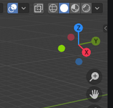
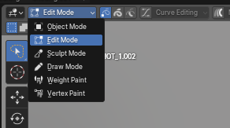

.. _blender-basics:

=========================================
Blender Basics for Animators
=========================================

.. note::

   **New to Blender?** If you have never used Blender before, you can still use the tool. Grease Pencil is a unique feature within Blender, and not the worst place to start. As a 3D program though, Blender has its own ways of handling navigation and shortcuts.
   This page covers the navigation, shortcuts, and Blender concepts you need to use Fred's plugin Tool and Blender's Grease Pencil mode together.

   If you are already comfortable with Blender, you can safely skip this page and head to :doc:`setup`.

This guide is adapted in part from Fred's "Blender Crash Course" for animators, which you can watch below. You can consider this page much briefer notes for reference.

  `Wolf's 45-Minute Crash Course for Blender Virgins <https://www.youtube.com/watch?v=RG8qK5zPqgM>`_ (~45 mins)

Blender is a huge program. In some ways, there's no reason to wait until you 'know enough' about a tool like Blender. Everyone has to start somewhere.

The following is all the parts of Blender that is relevant to Grease Pencil. Some of this carries over to other work in Blender.
When learning Blender, or any very complicated program, it's good to have a goal (like this!) in mind as you work, or you could lose yourself in learning how to do things in it you'll never even use.
No one does everything in Blender (normally).

--------------------------------------------------------------------------------

.. _navigation:

Viewport Navigation
-------------------

Before drawing, you need to know how to move around the scene. Generally, you will be locked into a plane for most things in Grease Pencil, but you'll still need to 'navigate'.

**Orbit (Rotate View):** Hold ``Middle Mouse Button`` and drag. (See :doc:`#Orbit<blender_manual:editors/3dview/navigate/navigation>`)

**Pan (Move View):** Hold ``Shift`` + ``Middle Mouse Button`` and drag. (See :doc:`#Pan<blender_manual:editors/3dview/navigate/navigation>`)

**Zoom:** Hold ``Ctrl`` + ``Middle Mouse Button`` and drag up/down. (See :doc:`#Zoom In/Out<blender_manual:editors/3dview/navigate/navigation>`)

**Strafe (Move Sideways):** Hold ``Alt`` + ``Middle Mouse Button`` and drag. (See :doc:`#'Dolly' View<blender_manual:editors/3dview/navigate/navigation>`)

**Toggle Perspective/Orthographic:** Press Numpad ``5``. (See :doc:`Perspective/Orthographic<blender_manual:editors/3dview/navigate/projections>`) *Orthographic* is essential for reference sheets (no distortion).

**Frame Selected:** Press Numpad ``.`` (Period) to zoom in on a selected object. (See :doc:`#Frame Selected<blender_manual:editors/3dview/navigate/navigation>`)

**View All:** Press ``Home`` to fit everything in the view. (See :doc:`#Frame All<blender_manual:editors/3dview/navigate/navigation>`)

**Camera View:** Press Numpad ``0`` to see exactly what the render will look like. (See :doc:`Camera View<blender_manual:editors/3dview/navigate/camera_view>`)

**Shading Modes:** Press ``Z`` to cycle between Wireframe, Solid, Material Preview, and Rendered. (See :doc:`Viewport Shading<blender_manual:editors/3dview/display/shading>`)

.. _quick-nav-reference:

Quick Navigation Reference
===========================

Essential 3D Viewport navigation shortcuts for Blender.

=========================== ========================================== =====================================================
**Action**                  **Shortcut**                               **Notes**
=========================== ========================================== =====================================================
**Orbit (Rotate View)**     ``Middle Mouse`` + Drag                    Standard rotation around the pivot.
**Pan (Move View)**         ``Shift`` + ``Middle Mouse`` + Drag        Moves the view parallel to the screen plane.
**Zoom**                    ``Ctrl`` + ``Middle Mouse`` + Drag         Drag **Up** to zoom in, **Down** to zoom out.
**Strafe (Slide View)**     ``Alt`` + ``Middle Mouse`` + Drag          Moves the view sideways.
**Toggle Perspective**      Numpad ``5``                               Essential for reference sheets (no distortion)
**Frame Selected**          Numpad ``.`` (Period)                      Zooms in tightly on the selected object.
**View All**                ``Home``                                   Fits all objects in the viewport.
**Camera View**             Numpad ``0``                               Shows exactly what will be rendered.
**Shading Modes**           ``Z``                                      Wireframe → Solid → Material Preview → Render preview
=========================== ========================================== =====================================================

*Figure 1: The navigation gizmo in the top-right corner*

--------------------------------------------------------------------------------

Manipulating Objects
--------------------

These are the three most important keys for :doc:`moving, rotating, and scaling<blender_manual:grease_pencil/modes/edit/tools>` objects.

*   **G (Grab/Move):** Select an object, press ``G``, and move the mouse to move it. Becareful with this when the camera view is locked to a plane, use:

    *   *Lock Axis:* Press ``X``, ``Y``, or ``Z`` after ``G`` to move along a specific axis.

    *   *Numeric Input:* Press ``G`` then immediately type a number (e.g., `5`) and ``Enter`` to move exactly `X` units.

*   **R (Rotate):** Select an object, press ``R`` and move the mouse to rotate.

    *   *Lock Axis:* Press ``X``, ``Y``, or ``Z`` after ``G`` to move along a specific axis.

*   **S (Scale):** Press ``S`` and move the mouse to resize.

    *   *Lock Axis:* Press ``X``, ``Y``, or ``Z`` after ``G`` to move along a specific axis.

.. tip::

   Locking the axis, numeric input and free-axis all work for Grab, Rotate and Scale, but these are the most likely combinations you'll find yourself using for Grease Pencil.

**Other useful commands:**

*   **Cancel:** Press ``Right Mouse Button`` to cancel the action and return to the original position.

*   **Confirm:** Press ``Left Mouse Button`` to confirm the change.

*   **Fine Tune:** Hold ``Shift`` while moving/scaling for slower, more precise adjustments.

*   **Grid Snap:** Hold ``Ctrl`` while moving to snap to the grid.

*   **Reset:** Press ``Alt`` + ``G`` (Location), ``Alt`` + ``R`` (Rotation), or ``Alt`` + ``S`` (Scale) to reset to default.

Object Modes
-----------------------------

Understanding the difference between modes is critical.

* **Object Mode:** You manipulate the object as a whole. (See :doc:`Object Mode<blender_manual:grease_pencil/modes/object/index>`)

* **Edit Mode:** You manipulate the *geometry* inside the object. In the context of GP, these are the points (vertex) that make up each stroke. This is the same as in vector layers in art programs. (See :doc:`Edit Mode<blender_manual:grease_pencil/modes/edit/introduction>`)

* **Draw Mode:** Use this mode for accessing and using brushes. Switching is generally handled by Fred's Tool, but it is helpful to understand what it is doing. (See :doc:`Draw Mode<blender_manual:grease_pencil/modes/draw/introduction>`)

Press ``Tab`` to toggle between modes.

*Figure 2: Location of Object Mode, Edit Mode, and Draw mode in the interface*

--------------------------------------------------------------------------------

Further Learning
----------------

:doc:`setup`

:doc:`keybindings`: Recommended shortcuts and suggested keybinds

:doc:`usage`: AFIS Workflow instruction