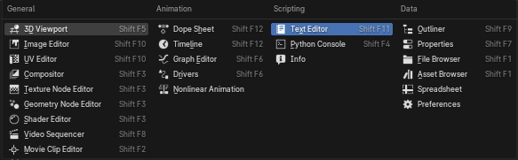
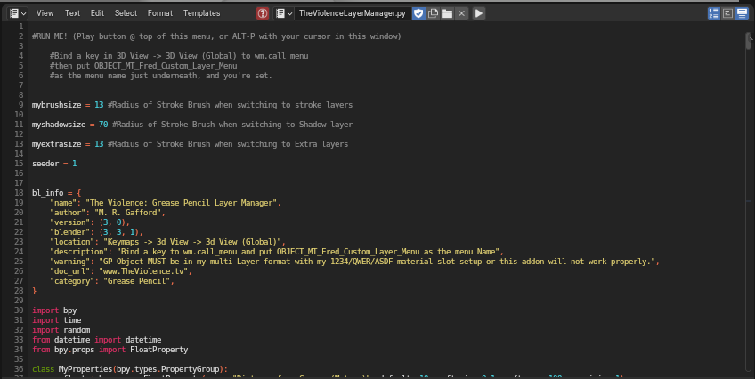
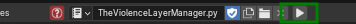

.. _setup:

Installation & Setup
====================

.. _prerequisites:

Prerequisites
-------------

* **Blender 5.2 LTS or 5.1** (required — other versions will cause compatibility issues)
* A Grease Pencil object already created in your scene (typically provided by Fred with pre-set layers and keyframes)
* A **monitor tablet** with pressure sensitivity is recommended but not required
* **Discord**: To get access to the file for now, updates, and the community for help.

.. note::

   You don't need to 'install' the tool on files that are already set up by
   Fred (such as inbetween or test files). However, when a revision comes
   out, you may want to update, in which case you'll need to re-run the
   script as described below.

--------------------------------------------------------------------------------

.. _requirements-warnings:

Requirements & Warnings
-----------------------

.. important::

   The Violence Layer Manager is designed for a specific Grease Pencil
   workflow. It will **not work** with arbitrary GP objects.

   This Grease Pencil Object must have:

   1. **Multi-layer format** — Layers named and organized according to the Violence Tool convention (Body, Head, Eyes, Mouth, etc.)

   2. **Material slot setup** — The ``1234/QWER/ASDF`` material slot configuration

   3. **Blender 5.2 LTS or 5.1** — The add-on now uses GPencil conventions introduced in Blender 4.3 and finalized in 5.0+.

**If your object doesn't match this format:**

   - The layer switching operators will fail (silently, as of now)
   - The panel buttons won't select the correct layers, or possibly any
   - You may see errors in the Blender console, or, it could fail silently depending on the issue.
   - If you're getting trouble like this on one of Fred's files, report it right away in the GreasePencil channel.

--------------------------------------------------------------------------------

.. _getting-the-tool:

Getting the Tool
----------------

The Violence Tool is currently distributed exclusively through **Fred's Discord server**.

   1. **Join the Server:** If you haven't already, join the Discord community linked on the project homepage.
   2. **Ask for access to the Grease Pencil channel:** Resources and the py file are pinned to the channel.
   3. **Download:** Save the Violence Layer manager .py file to your computer.

.. important::

   There is no public website, GitHub repository, or Blender Market listing for this tool yet.
   Access is restricted to the Discord community for early testing and workflow development.
   If you are not a member, please contact Fred directly to request an invitation. We're friendly!

--------------------------------------------------------------------------------

.. _installation:

Installing the Tool
-------------------

There are two ways to install The Violence Tool, as a plugin, or running it through the Text Editor.

Method 1: Run from the Text Editor (Quick Start)
~~~~~~~~~~~~~~~~~~~~~~~~~~~~~~~~~~~~~~~~~~~~~~~~

The script runs directly in Blender's Text Editor. But you'll have to load it each time, and its operators won't be available for keybinds.

Step 1: Open the Text Editor
^^^^^^^^^^^^^^^^^^^^^^^^^^^^

   1. In Blender, switch any window to the **Text Editor** (click the editor type icon in the top-left corner and select "Text Editor").

*Figure 1: Switch a window to the Text Editor*

Step 2: Load the Script
^^^^^^^^^^^^^^^^^^^^^^^

   1. Click **Open** in the Text Editor toolbar.
   2. Navigate to the ``.py`` file for The Violence Tool.
   3. Select the file and click **Open**.

Alternatively, you can drag and drop the ``.py`` file directly into the Text Editor window.

*Figure 2: The script loaded in the Text Editor*

Step 3: Run the Script
^^^^^^^^^^^^^^^^^^^^^^

   1. Click the **Play Button** (▶️) at the top of the Text Editor toolbar.

*Figure 3: Click the Play button to run the script*

.. warning::

   Running the script will overwrite any unsaved changes to the script
   file. Always save your modifications before running.

--------------------------------------------------------------------------------

Method 2: Install as a Blender Add-on (Recommended)
~~~~~~~~~~~~~~~~~~~~~~~~~~~~~~~~~~~~~~~~~~~~~~~~~~~

This method installs the tool permanently so it loads every time you open Blender, via the N menu.

Step 1: Save the Script
^^^^^^^^^^^^^^^^^^^^^^^

Save the ``TheViolenceLayerManager.py`` file (or however it's currently named), to a location on your computer. 

Step 2: Install via Preferences
^^^^^^^^^^^^^^^^^^^^^^^^^^^^^^^

   1. In Blender, go to **Edit** → **Preferences**.
   2. Click the **Add-ons** tab.
   3. Click the **Install...** button (top left).
   4. Navigate to your saved ``.py`` file and select it.

Step 3: Enable the Add-on
^^^^^^^^^^^^^^^^^^^^^^^^^

   1. Find "The Violence: Grease Pencil Layer Manager" in the list (or search for "Violence").
   2. **Check the box** to enable it.
   3. Click **Save Preferences** (bottom left) to ensure it loads on startup.

Verifying Installation
~~~~~~~~~~~~~~~~~~~~~~

**The Fred Tab is currently not implemented in this version**

Regardless of which method you chose:

   1. Switch to the **3D Viewport**.
   2. Press **N** to open the sidebar (if not already visible).
   3. Look for the **"Fred"** tab.

.. image:: ../_static/images/fred-tab-appears.png
   :alt: Fred tab in the sidebar
   :width: 300
   :align: center

*Figure 4: The "Fred" tab appears in the sidebar*

If you see the panel with layer buttons, the installation was successful!

.. note::

   The Fred Panel is **not yet implemented** in v2.0. To verify the tool is running,
   press ``F3`` and search for one of the tool's operators (e.g., ``gpencil.draw_mode``).
   If it appears in the search results, the tool is installed and active.

--------------------------------------------------------------------------------

.. _updating:

Updating the Tool
-----------------

When a new version of the script is released:

   1. **Save any custom changes** you made to the script first (if applicable).
   2. Close the old script in the Text Editor (Method 1) or remove the old add-on in Preferences (Method 2).
   3. Load the new ``.py`` file.
   4. Run the script or re-enable the add-on.
   5. Re-implement any changes you may have made.

.. warning::

   Updating will overwrite any unsaved changes to the script file. Always save your modifications before updating.

If you receive an error, try changing the name to TheViolenceLayerManager.py.

--------------------------------------------------------------------------------

.. _configuring:

Configuring Keybindings
-----------------------

For optimal workflow, we highly recommend configuring specific keyboard shortcuts. See :doc:`keybindings` for detailed setup instructions on:

   - Holding **Alt** to nudge lines while drawing (often referred to as 'sculpt'ing lines)
   - Using **F** to change sculpt radius
   - Quick-switching between Draw, Erase, Sculpt, and Fill modes with single keys
   - Toggling "Fade Inactive Layers"

And others!

.. tip::

   These keybindings are optional but are important for efficiency when using The Violence Layer Manager.
   You can bind as many or few as you prefer - and to any key you want - the keybindings here are just suggestions.

--------------------------------------------------------------------------------

.. _setup-faq:

What if I want to use this for my own project?
----------------------------------------------

This is welcome, but could involve some organization that might be unique to your project, depending on your style. Here's what we recommend to start:

   1. Practice with the provided scene files using the default setup for AFIS to get an idea of how the system works
   2. Play around and find your personal workflow
   3. Consider sharing with us what you discovered!

.. note::

   As the community grows, we hope to share your invented workflows, keybinds, and guides.

--------------------------------------------------------------------------------

.. _next-steps

Next Steps
----------

Once installed, head to :doc:`usage` to learn the daily workflow and
practice with the provided scene files.

Definately set a few :doc:`keybindings`!

See :doc:`blender-basics` if you are new to Blender in general.

:doc:`use-cases` explains how-tos by user goal, which might be helpful.

:doc:`troubleshooting` is a collection of symptom-based help. :doc:`use-cases` has troubleshooting sorted by goal 'step' instead.