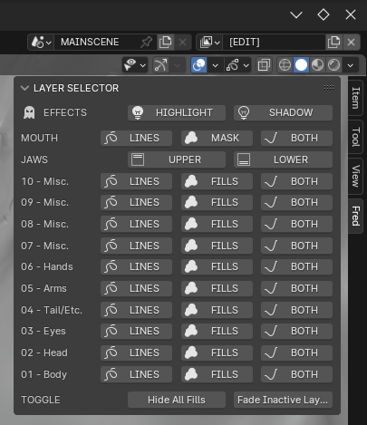
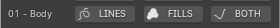
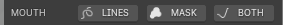

.. _usage:

===============================
The Violence Tool - User Manual
===============================

.. note::
   This documentation covers **v1.0** of the tool. A refactor is in progress that will add undo support, improved error handling, and more stability. See :doc:`versioning` for the roadmap.

Quick Links
-----------

   * :doc:`setup` - How to install the tool
   * :doc:`use-cases` - Technicaly instructions by workflow
   * :doc:`troubleshooting` - Current limitations and workarounds

.. _getting-started:

Getting Started
---------------

Before diving into the workflow, ensure you have the correct practice files to follow along.
The tool requires a specific Grease Pencil object setup:

**Download the Practice Files**

.. raw:: html

   

     <a href="https://github.com/Danweel/ProjectViolenceDocs/releases/download/practice-files-v1/TheViolence_Practice_File_v1.blend"
        style="background-color: #1C8E85; color: white; padding: 12px 24px; text-decoration: none; border-radius: 6px; display: inline-block; font-weight: bold; font-family: sans-serif;">
       Download Practice File (v1.0)
     </a>
     

       File size: ~45 MB | Format: .blend
     

   

*If the button above does not work, visit the `GitHub Releases page <https://github.com/Danweel/ProjectViolenceDocs/releases>`_ directly.*
TODO #35 Confirm training files

First Steps
-----------

1.  **Open the File**: Launch Blender, go to **File → Open**, and select the downloaded file "FILE PLACEHOLDER TODO #31 #30".

.. Note::

   If you see a "Missing Libraries" warning, click "Ignore" (this can happen for practice files).

2.  **Verify the Setup**:

   * Look at the :doc:`Outliner<blender_manual:editors/outliner/introduction>` area. You should see a Grease Pencil object named "FILE PLACEHOLDER".
   * Select it.
   * Press ``N`` to open the Sidebar.
   * Click the **Fred** tab. You should see the **LAYER SELECTOR** panel.

3.  **Try It Out**:

   * Click a **LINE** button in the panel. Draw a line.
   * Click a **FILL** button. Draw a closed circle around the line.
   * Switching back to the body, you'll see how the layers change automatically.
   * Ctrl-Z will undo most operations.

.. _interface-overview:

If you are unfamiliar with Blender navigation, see :doc:`blender-basics` before proceeding.

Interface Overview
------------------

The Violence Tool :ref:`installation` adds a panel called **"Fred"** to the 3D Viewport sidebar (press **N** to toggle this sidebar's visibility).

*Figure 1: The Fred Panel in the 3D Viewport sidebar*

The panel is organized into sections:

   * **Effects** - Highlights, shadows, and special effects
   * **Mouth** - Mouth lines, mask, and jaw controls
   * **Jaws** - Upper and lower teeth layers
   * **Layers 01-10** - Body, head, eyes, and miscellaneous layers
   * **Toggles** - Visibility and fade controls

Selecting Drawing Layers
------------------------

Each section contains buttons for different layer types:

   * **LINES** - Switches to the stroke/line art layer (uses "Ink Pen" brush)
   * **FILLS** - Switches to the fill/color layer (uses "Fill Area" brush)
   * **BOTH** - Unlocks both line and fill layers at the same time for 'sculpting' lines

*Figure 2: Layer buttons for Body (01 - Body)*

When you click a layer button:

   1. The tool automatically selects the correct Grease Pencil layer
   2. The appropriate brush is activated (Draw or Fill)
   3. The correct material is assigned
   4. Other layers are locked to prevent accidental edits

.. note::

   Brush sizes are preset for each layer type. If the size seems wrong, check the Toolbar on the left side of the 3D Viewport.

.. _core-workflow:

Core Workflow: Drawing & Filling
--------------------------------

.. tip::

   **Quick Reference:** To switch layers, click the **LINES**, **FILLS**, or **BOTH** button next to any section (Body, Head, Eyes, etc.). The tool automatically selects the correct layer, activates the right brush, and locks other layers.

This section walks you through drawing a single frame of animation.

**Switching to a Line Layer**
~~~~~~~~~~~~~~~~~~~~~~~~~~~~~

   1. Decide what part you want to draw. For example, the **body**
   2. Click the **LINES** button next to **01 - Body**

   *What happens:*

   * You enter Paint Mode automatically.
   * The active layer switches to the body lines layer.
   * Your brush is set to the line material.

   3. Draw your lines

**Switching Between Parts**
~~~~~~~~~~~~~~~~~~~~~~~~~~~

When you finish the body and want to draw the head:

   1. Click **LINES** next to **02 - Head**
   2. Draw the head

That is it. One click switches you instantly. No menus, no scrolling.

.. tip::

   If you accidentally draw on the wrong layer, just click the correct button. Your strokes stay on whatever layer was active when you drew them.

**Filling with Color**
~~~~~~~~~~~~~~~~~~~~~~

   1. Click the **FILLS** button next to the part you want to fill

      For example, **01 - Body** → **FILLS**

      *What happens:*

      * The active layer switches to the body fill layer.
      * Your brush is set to the fill material.

   2. Use the **Bucket Fill** tool or draw closed shapes to fill the area

**The Mouth Mask**
~~~~~~~~~~~~~~~~~~

The mouth uses a special technique to prevent the tongue from showing through the teeth.

   1. Draw the teeth on the **Mouth Lines** layer
   2. Click **MOUTH: Mask** to switch to the mask layer
   3. Draw a filled shape *behind* the teeth but *in front* of the background

The mask material is opaque, so it hides the tongue layer behind it while the teeth layer stays visible in front.

.. note::

   This only works if your materials are set up correctly. See :doc:`troubleshooting` if the mask does not look right.

**The Automerge Toggle** (During Drawing)
~~~~~~~~~~~~~~~~~~~~~~~~~~~~~~~~~~~~~~~~~

When set up, as you draw a new stroke that touches an existing one, Blender automatically merges
the vertices at the contact point. This creates a "closed" shape, allowing fills to work automatically.

Fred uses a Hold-to-Activate for this:

   1. Go to Edit → Preferences → Keymaps
   2. Search for "fred.op16", which is the tool's automerge function
   3. Bind it to ``A`` (or your own preferred key) with event type "**Press**" TODO Doublecheck OP16 keybind
   4. Search for "fred.op17" (Disable automerge)
   5. Bind it to ``A`` with event type "**Release**"

This will set holding the key down automatically activating automerge, and releasing it disables it, so the
function is not on all the time.

**Method**:

   1. Be in Draw Mode
   2. Hold ``A`` and start drawing (TODO #29 can you start drawing and then hold it?)
   3. Overlap the previous stroke
   4. Release ``A`` - Let go immediately after the stroke is finished

.. tip:: Draw the line in one continuous motion if possible.

You have to draw slightly past the intersection point of your lines. The tool needs physical overlap to calculate the
merge. If you go only up to the line it might not trigger; doing this can sometimes leave a microscopic gap. Make sure
to draw 2-3 pixels over the existing line.

**Visual Check**: If Automerge worked, the vertices at the junction will look like a single point. If you zoom in ``Ctrl``+ ``Middle Mouse``
and see two distinct dots touching, the merge failed.

.. warning:: If you keep A held while drawing within a shape, you might accidentally merge lines you didn't intend to (e.g., merging the chin line with the neck line). (TODO #28 I need a few more examples/tests unintended merges)

The "Join" Operator (for after drawing)
~~~~~~~~~~~~~~~~~~~~~~~~~~~~~~~~~~~~~~~

If you forgot to use Automerge, or if the lines are close but not touching, you can still manually join them.

Fred's Bind: ``Alt`` + ``F`` Joins and Smooths via OP03 in the tool. See :doc:`keybindings` on how to set this to a key press.
Native Blender: ``M`` → By Distance (Merges vertices) OR ``F`` (Creates a new edge between two selected vertices).

   1. Be in Edit Mode ``Tab``
   2. Select the Vertices
   3. Click the two vertices at the gap (or box select ``B`` around the gap)
   4. Join:

      - If using Fred's keybind: Press ``Alt`` + ``F`` - this also smooths the joint so it doesn't look jagged.
      - With regular Blender functions: Press ``M`` and select By Distance (merges them into one) OR press ``F`` (creates a new line segment connecting them).

You can also use this to make a clean up pass after the rough sketch.

.. _advanced-workflows:

Advanced Workflows
------------------

**Mouth Animation**
~~~~~~~~~~~~~~~~~~~

The mouth section has specialized controls for lip-sync work.

**Mouth: Lines, Fills, Both** - Unlocks related mouth layers for keyframing. These buttons work similarly to any other layer.

**Jaws: 'Upper' and 'Lower'** - Unlocks all mouth-related layers for that area

   * **LINES** - Mouth outline strokes
   * **MASK** - Throat/tongue mask layer (0 alpha)
   * **BOTH** - Generally for nudging lines and fills together

   * **UPPER** - Upper teeth
   * **LOWER** - Lower teeth and tongue

*Figure 4: Mouth material buttons*

Click the various "Frames" buttons to unlock the various mouth layers for editing. This allows
you better control to draw on the Mouth and Mask layers simultaneously without accidentally
editing the Body or Head. The Jaw buttons unlock the Jaw layers, though these are typically
mainly used for the lead animator(s), so you may not have to worry about it too much
for AFIS work. This will come into play on your own projects.

**Stroke Simplification**
~~~~~~~~~~~~~~~~~~~~~~~~~

Drawing like this often makes too many vertices and creates a huge file size, once the basic shapes are defined,
you can simplify the strokes to have fewer points to represent the same shape. The fewer points you have to
describe the shape though, the more angular the line will look.

   1. Select all strokes (or use multi-frame Editing)
   2. Press ``F3``
   3. Search "Adaptive"
   4. Select "Simplify Stroke" (or "Adaptive Point Reduction")
   5. A popup appears with a slider or input field

      - Set "Threshold": Start with 0.001
      - Higher value = More simplification (fewer vertices, but will lose detail the fewer there are)
      - Lower value = Less simplification (preserves more of the original gesture you drew)

   6. Click OK or press ``Enter``

.. warning::

   Simplification is **destructive**. It permanently removes vertices from your
   strokes. Press ``Ctrl+Z`` immediately to undo if you don't like the result.
   Once you save or clear the undo history, the original detail is gone.

**Multi-Frame Editing**
~~~~~~~~~~~~~~~~~~~~~~~

A feature that allows you to select and edit strokes across multiple frames at once.

   1. Enable Multi-Frame:

      - In the Grease Pencil properties (green icon), look for the multi-frame section
      - Check Enable
      - Set the Range (e.g., -5 to +5 to see 5 frames before and after).

   Alternatively: In the Timeline or Dope Sheet, you can select multiple frames (``Shift``+ ``Click``) to enable multi-frame editing

   2. Select Strokes:

      - Enter Edit Mode
      - Select a stroke. It will now select the same stroke on all visible frames in the range

   3. Edit:

      - Move, scale, or delete the stroke. It applies to all selected frames.

**Simplify (Adaptive)** with multi-frame editing:

      1. With multi-frame active, select all ``A``
      2. Press ``F3``, search Adaptive
      3. Set the threshold

This simplifies every frame in the range instantly.

**Effects & Special Tools**
~~~~~~~~~~~~~~~~~~~~~~~~~~~

There is a plan to offer a button for applying noise to an object via the Fred panel, but in 1.0 this isn't yet implemented. Here's how to do it via Blender's native interface:

In Edit Mode:

1. Select your Grease Pencil object and select all strokes with ``A``.
2. Go to the Modifiers Tab (Wrench icon).
3. Click Add Modifier → Effect → Randomize.
4. Adjust Position (jitter amount) and Scale (detail level).

**Sculpting the Shape** (Butter-knifing)
~~~~~~~~~~~~~~~~~~~~~~~~~~~~~~~~~~~~~~~~

Sometimes you need to push and pull the whole shape instead of redrawing it.

   1. Click **BOTH** next to the part you want to adjust. i.e., **01 - Body** → **BOTH**

      *What happens:* That layer is isolated for easier editing

   2. Use the **Grab** ``G`` or **Smooth** brush modifier ``Shift`` to adjust the shape
   3. Click any **LINES** or **FILLS** button to return to drawing

**Toggle Controls**
~~~~~~~~~~~~~~~~~~~

At the very bottom of the panel, there are two TOGGLE buttons:

   * **Hide All Fills** - Toggles visibility of fill layers.
   * **Fade Inactive Layers** - Fades layers that are not currently active.

**Fixing Mistakes**
~~~~~~~~~~~~~~~~~~~

* **Erasing**: Press ``E`` or select the Eraser tool. You only erase on the **active layer**. Check which button is highlighted before erasing.
* **Undo**: Press ``Ctrl``+ ``Z`` to undo your last action.
* **Moving lines to a new layer**: If you notice you drew on the wrong layer your strokes can be reused: (TODO #32 test copy pasting strokes)

   1.  Select and copy the errant strokes
   2.  Cut (or copy)
   3.  Click the correct layer button
   4.  Paste on the correct layer
   5.  Switch to the wrong layer and erase the misplaced strokes if needed

**Keyframes**
~~~~~~~~~~~~~

.. note:: The tool does not create keyframes. Use Blender's standard keyframe shortcut, ``I``.

How to add keyframes:

1. Make sure you're in the Dope Sheet
2. Press ``I`` with your cursor over that area of the screen
3. Select Duplicate Active Keyframe

This will duplicate all unlocked layers onto the next frame and set that frame active. This means you'll want to have certain layers
locked or unlocked depending on what of your frame and what you want to copy forward.

.. _tips-tricks:

Tips & Tricks
-------------

*   **Resize the Panel**: Go to the panel you want to change, hold ``CTRL``, and hold the ``Middle Mouse Button``. Move your mouse up to make buttons bigger, or down to make them smaller.
*   **Restore Default Size**: Move the mouse cursor over the panel and press ``HOME``.
*   **Save Frequently**: Undo support is limited in the current version.
*   **Check Layer Visibility**: Hidden layers cannot be edited (see :doc:`/user/troubleshooting`).
*   **Erasing**: For precision erasing, use Edit Mode ``Tab`` and delete points ``X``.
*   **Ink Pen**: Fred sets his brush to Ink Pen with Hardness 1.0 for vector-like lines.

.. _concepts:

Concepts
--------

**Material Slots vs. Materials**
~~~~~~~~~~~~~~~~~~~~~~~~~~~~~~~~

Changing a material in a slot changes it on every frame that uses that slot.

**Benefit**: You don't have to refill every frame. Change the color in the material slot, and the whole animation updates instantly.

.. tip::

   To make a unique color for one part, you must create a Unique Copy of the material (using the "New" button with the icon of two overlapping circles) and assign it to a new slot.

**The difference between Dope Sheet and Timeline**
~~~~~~~~~~~~~~~~~~~~~~~~~~~~~~~~~~~~~~~~~~~~~~~~~~

**Timeline**: Controls object movement (Location, Rotation, Scale) and global scene changes.

**Dope Sheet** (Grease Pencil Mode): Controls the actual drawing frames (artwork changes).

You can have a character standing still (no Timeline keys) while their mouth moves (Dope Sheet keys).

**Changing a Color for a Specific Layer**
~~~~~~~~~~~~~~~~~~~~~~~~~~~~~~~~~~~~~~~~~

This involves creating a **Unique Material Copy**:

In Grease Pencil, a Layer is a container for strokes. Each layer has one active material slot. By changing the
slot assigned to the layer, you change the color of every stroke on that layer instantly, across all keyframes.

.. warning::

   This is an edge case, probably not something you'll be doing for AFIS, but it helps clarify how materials are assigned and work for troubleshooting and setting up your own projects.

If you need to change the color of a specific part (e.g., a red jacket) without affecting the rest of the project:

**Step 1**: Create the Unique Copy

Be in **Object Mode**:

   1. Select the Grease Pencil Object
   2. Go to the Material Properties tab (Red Sphere in the Properties Editor)
   3. Locate the material you want to duplicate (e.g., Body Fill)
   4. Click the "New" Button (Two overlapping circles, to the right of the material name)

      **Note**: This will create a copy of the current material in a new slot.

      Do not click the "New" button that creates a *blank* material; click the one that *copies* the current one.

   5. A new slot appears with the copy (e.g., Body Fill.001)
   6. Double-click and rename to something clear
   7. Change the Base Color of this new material to your new color:

**Step 2**: Assign the Material to the Layer

Be in **Object Mode** or **Draw Mode**:

   1. Open the Grease Pencil tab in the Properties Editor (Green Pencil tab in the Properties Editor)
   2. Expand the Layers list
   3. Find the layer you want to change (e.g., Body Fill)
   4. Look for the Material dropdown menu next to the layer name
   5. Click the dropdown and select your new material

   **Create a Unique Copy:**

      1. In **Object Mode**, go to **Material Properties**.
      2. Select the material slot you want to change.
      3. Click the **"New" button** (two overlapping circles) to create a copy.
      4. Rename it (e.g., "Jacket Red") and change its color.

   **Assign to the Layer:**

      5. Go to the **Grease Pencil Properties** tab (Green Pencil icon).
      6. Find the layer you want to change (e.g., "Jacket Fill").
      7. In the **Material** dropdown next to the layer name, select your new material ("Jacket Red").

   .. note::

      This changes the color for **all strokes/fills** on that layer.

**Brush Size Auto-Change feature**
~~~~~~~~~~~~~~~~~~~~~~~~~~~~~~~~~~

The tool attempts to set the brush size when you switch layers. Sometimes this fails, or the user's manual override sticks. Currently,
this won't always be clear why this happens. Here's some notes about that issue:

   - If you manually change the brush size in the Toolbar, the tool might not reset it on the next switch.
   - If you switch from Draw to Sculpt and back, the brush settings might reset to defaults.
   - New Project: If you start a new project, the tool will not have the presets loaded yet (or will have the wrong ones - right now, the default is Fox' materials).

   .. admonition:: Fred's Tip

      "The tool attempts to set the correct brush size automatically when you switch layers. If the size looks incorrect, check the Toolbar (left side of the 3D Viewport) and adjust the Radius slider manually."

.. warning::

   You probably won't have to do that for AFIS files, though. Double check with Fred if the file seems to be giving you the wrong thing.

**Pressure Sensitivity for brushes**
~~~~~~~~~~~~~~~~~~~~~~~~~~~~~~~~~~~~

Here's how you work with pressure sensitivity, for your own projects, or to help understand better how this feature interacts with Grease Pencil and the tool.

In **Draw Mode**:

   1. Press N to open Properties → Tool Tab.
   2. Click Brush Settings
   3. Look for **Radius** (Size slider) and/or **Strength** (Opacity slider):

      Click the toggle button next to these (the Pin with Ripple icon). This will enable pressure sensitivity for the corresponding element.

   4. Calibrate: Adjust the slider to your minimum desired size. The tablet pressure settings will compound with this.

The Violence Tool is supposed to control pen settings for you though, so this should be preset using tool layer buttons. For now, this requires going into the tool script itself and changing the numbers if you want to make them different. You'll want
to save your version for your project seperately. Use whatever version of the tool is already in the scene provided by Fred, it'll have the right settings set up.

.. _practice-files:

Practice Files & Next Steps
---------------------------

It's a good idea to practice with the following files before jumping into your own project. They've been selected to cover most of the quirks of how the tool works with different
kinds of scenes. 3D animation is already complete, and in most cases, the keyframes as well, so you only need to practice controlling your art.

**Available Practice Files:**
~~~~~~~~~~~~~~~~~~~~~~~~~~~~~

1.  **Full body workfile** — Good for getting the hang of how to draw in this Grease Pencil workflow, and start building skills on matching the artstyle.

   *   *placeholder for practice file*

2.  **Simple animation** — Good for starting to work with multiple frames, applying jitter and getting better with in-betweening.

   *   *placeholder for practice file*

3.  **Transparency layers and jaw movement** — Covers the special masking that is used for the teeth (such as Wolf's), tongue and muzzle masks.

   *   *placeholder for practice file*

4.  **Head turn** — Introduces the way layers switch hierarchy when a character is turning to or away from the 'camera'.

   *   *placeholder for practice file*

**Extras:**
~~~~~~~~~~~

Extra practice files, such as for specific characters or other useful oddities.

   *   *placeholder for practice file*

.. tip::

   Post your results in the Grease Pencil #channel on Discord for feedback.

.. seealso::

   :ref:`keybindings` To make your life easier, try Fred's recommended binds.

   :ref:`troubleshooting` Having trouble? Try taking a look here.

   :ref:`use-cases` These are intended as goal-oriented how-tos, and as basic technical documentation. Includes process-based troubleshooting.
